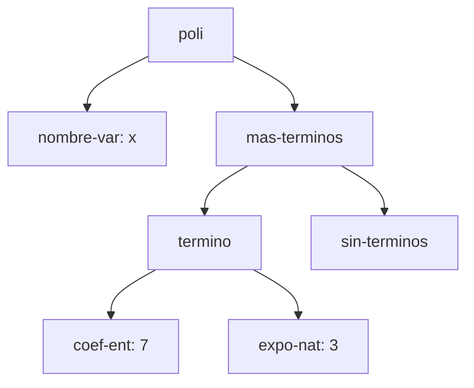
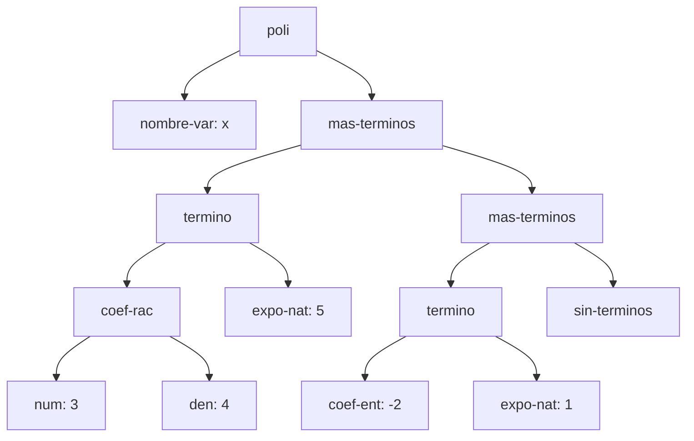
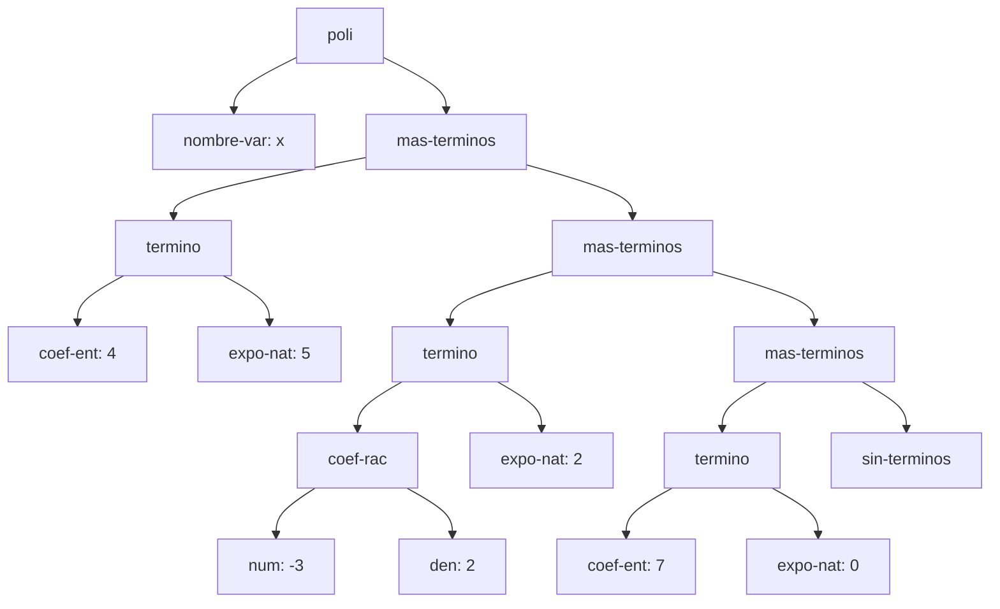
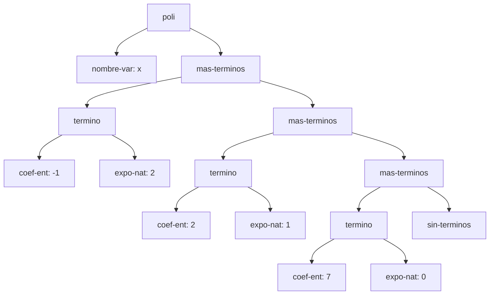

# Informe de AST — Taller 1: polinomios dispersos

**Curso:** Fundamentos de Interpretación y Compilación de Lenguajes
de Programación — Universidad del Valle, Sede Tuluá.

**Integrantes del grupo:**

| Nombre | Código | Correo institucional |
|--------|--------|----------------------|
| Juan Eduardo Calderon Jaramillo | 2611001-3743 | juan.eduardo.calderon@correounivalle.edu.co |
| {{Nombre 2}} | {{Código 2}} | {{correo2@correounivalle.edu.co}} |
| {{Nombre 3}} | {{Código 3}} | {{correo3@correounivalle.edu.co}} |

---

## 1. Gramática considerada

Esta es la gramática del enunciado. Los nombres del recuadro son los
constructores que deben aparecer como etiquetas en los diagramas de la
sección 2.

```bnf
<polinomio>   ::= <variable> <terminos>
                  poli(var, terms)

<variable>    ::= <symbol>
                  nombre-var(s)

<terminos>    ::= '()
                  sin-terminos()
                | <termino> <terminos>
                  mas-terminos(term, resto)

<termino>     ::= <coeficiente> <exponente>
                  termino(coef, expo)

<coeficiente> ::= <int>
                  coef-ent(n)
                | <int> "/" <int>
                  coef-rac(num, den)

<exponente>   ::= <int>
                  expo-nat(k)
```

Indique cómo se realiza cada no terminal en su implementación con
`define-datatype`:

| No terminal | Variantes del datatype | Campos |
|---|---|---|
| `<polinomio>` | `poli` | `var`, `terms` |
| `<terminos>` | `sin-terminos`, `mas-terminos` | `sin-terminos`: ninguno; `mas-terminos`: `term`, `resto` |
| `<termino>` | `termino` | `coef`, `expo` |
| `<coeficiente>` | `coef-ent`, `coef-rac` | `coef-ent`: `n`; `coef-rac`: `num`, `den` |
| `<exponente>` | `expo-nat` | `k` |

---

## 2. Ejemplos de AST

> Los cuatro ejemplos que siguen son los que pide el enunciado. Cada
> uno lleva el polinomio escrito en notación matemática, el AST como
> diagrama Mermaid con los nombres de los constructores en los nodos,
> y una explicación breve.
>
> El nodo del final de la lista de términos, `sin-terminos`, se dibuja
> siempre: es el caso base de la recursión y sin él el árbol queda
> incompleto.

### Ejemplo 1 — un solo término con coeficiente entero

**Polinomio:** $p_1 = 7x^{3}$

**Construcción:**

```scheme
(poli (nombre-var 'x)
      (mas-terminos (termino (coef-ent 7) (expo-nat 3))
                    (sin-terminos)))
```

**AST:**



**Explicación:** el nodo `nombre-var` guarda el símbolo de la variable (`x`), separado de la lista de términos. El único término del polinomio cuelga de `mas-terminos`, cuyo segundo hijo es `sin-terminos`: ese nodo cierra la lista y marca que no hay más términos después. El coeficiente y el exponente son nodos separados porque termino tiene los campos coef y expo.

---

### Ejemplo 2 — dos términos, uno con coeficiente racional

**Polinomio:** $p_2 = \frac{3}{4}x^{5} - 2x$

**Construcción:**

```scheme
(poli (nombre-var 'x)
      (mas-terminos (termino (coef-rac 3 4) (expo-nat 5))
                    (mas-terminos (termino (coef-ent -2) (expo-nat 1))
                                  (sin-terminos))))
```

**AST:**



**Explicación:** `coef-rac` se diferencia de `coef-ent` en que tiene
**dos** hijos (`num` y `den`) en vez de uno solo (`n`), porque representa el numerador y el denominador por separado. El orden  decreciente de exponentes que exige el invariante se ve en la
*anidación* de los `mas-terminos`: el término con exponente 5 aparece en el primer nivel, y el de exponente 1 en el `mas-terminos` anidado  inmediatamente después — nunca en orden inverso.

---

### Ejemplo 3 — tres o más términos, con término independiente

**Polinomio:** $p_3 = 4x^{5} - \frac{3}{2}x^{2} + 7$

**Construcción:**

```scheme
(poli (nombre-var 'x)
      (mas-terminos (termino (coef-ent 4) (expo-nat 5))
                    (mas-terminos (termino (coef-rac -3 2) (expo-nat 2))
                                  (mas-terminos (termino (coef-ent 7) (expo-nat 0))
                                                (sin-terminos)))))
```

**AST:**



**Explicación:** el término independiente se representa igual que
cualquier otro término. La diferencia es que su exponente es `0`, por
lo que aparece como `expo-nat: 0`.

---

### Ejemplo 4 — el resultado de `(sumar p q)`

Usando los polinomios del ejemplo de la Parte 3 del enunciado:

**Operandos:**

- $p = 4x^{5} - \frac{3}{2}x^{2} + 7$
- $q = -4x^{5} + \frac{1}{2}x^{2} + 2x$

**Resultado:** $p + q = -x^{2} + 2x + 7$

**Construcción del resultado:**

```scheme
(poli (nombre-var 'x)
      (mas-terminos (termino (coef-ent -1) (expo-nat 2))
                    (mas-terminos (termino (coef-ent 2) (expo-nat 1))
                                  (mas-terminos (termino (coef-ent 7) (expo-nat 0))
                                                (sin-terminos)))))
```

**AST del resultado:**



**Origen de cada nodo:**

| Término del resultado | Viene de | Observación |
|---|---|---|
| $-1x^{2}$ | suma de ambos | $p$ aporta $-\frac{3}{2}$ y $q$ aporta $\frac{1}{2}$; $-\frac{3}{2}+\frac{1}{2}=-1$ |
| $2x^{1}$ | $q$ | $p$ no tiene término de exponente 1, pasa sin combinarse |
| $7x^{0}$ | $p$ | $q$ no tiene término independiente, pasa sin combinarse |

**Términos cancelados:** el término de exponente 5 se cancela por
completo: $p$ aporta $4$ y $q$ aporta $-4$, y $4+(-4)=0$. Por la
segunda condición del invariante ("sin ceros"), el término de
exponente 5 no se incluye en la cadena de `mas-terminos`, porque su
coeficiente resultante es 0.

---

## 3. Referencias

- Friedman, D. P., & Wand, M. *Essentials of Programming Languages*,
  3.ª ed., MIT Press, 2008. Sección 2.1 (especificación de datos),
  sección 2.2 (representaciones de un TAD), sección 2.4
  (`define-datatype` y `cases`).